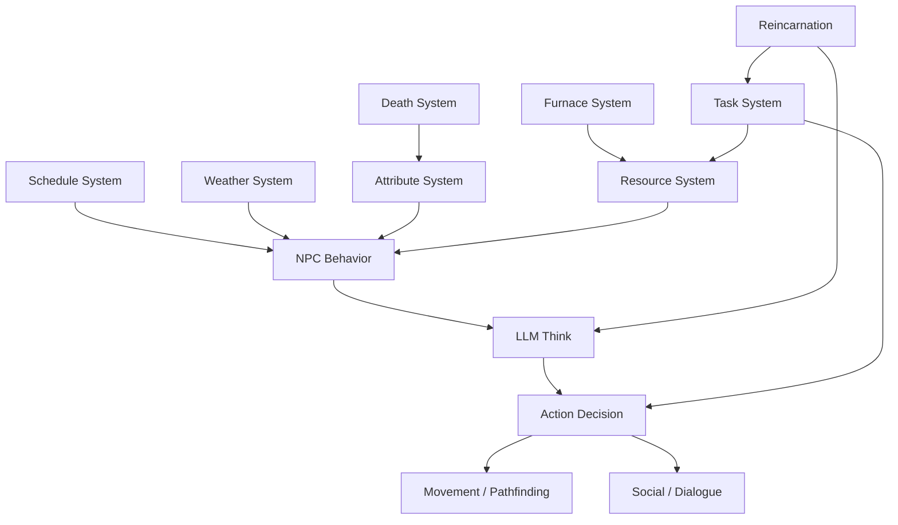

<p align="center">
  <h1 align="center">🥶 AI Game: Gospel Snow Town</h1>
  <p align="center">
    <em>An AI-driven pixel-art survival simulation where 8 autonomous NPCs fight to survive a 4-day apocalyptic blizzard — powered by LLM reasoning.</em>
  </p>
  <p align="center">
    <a href="./README_CN.md">中文文档</a> · 
    <a href="#quick-start">Quick Start</a> · 
    <a href="#features">Features</a> ·
    <a href="#architecture">Architecture</a>
  </p>
  <p align="center">
    
    
    
    
    
  </p>
</p>

---

## 🎬 What is This?

**Gospel Snow Town** is a real-time AI survival simulation game. You don't play *as* the characters — you **watch them live, think, argue, cooperate, and die**.

Eight strangers are trapped in a frozen village as temperatures plunge from -10°C to -60°C over 4 days. Each NPC is powered by an LLM (Large Language Model) that drives their thoughts, conversations, and survival decisions in real-time. There is no script. Every playthrough tells a different story.

> *Think "The Long Dark" meets "Dwarf Fortress" meets "Stanford Generative Agents" — but in a browser.*

### 🎯 The Core Loop

```
Day 1 (-10°C): Discover the crisis. Gather supplies. Build trust.
Day 2 (-25°C): Temperature drops. Conflicts emerge. Resources run low.
Day 3 (0°C, The Calm): A brief respite. Race to prepare for tomorrow.
Day 4 (-60°C, Blizzard): The final test. Not everyone will survive.
```

If everyone dies — the world **reincarnates**. NPCs carry faint memories from past lives, making different choices each cycle. The question isn't *if* they survive, but *who* survives and *what they become*.

---

## ✨ Features

### 🧠 LLM-Powered Autonomous NPCs
- Each of the 8 NPCs has a unique personality, backstory, skills, and family relationships
- NPCs **think independently** using LLM — analyzing threats, opportunities, and social dynamics
- Conversations emerge naturally between NPCs based on context, mood, and urgency
- NPCs remember past interactions and form opinions about each other

### ❄️ Hardcore Survival Systems
- **Body Temperature** — Exposure below -25°C causes hypothermia → health drain → death
- **Hunger** — 4 hours of starvation triggers accelerated health loss (death in ~11 minutes)
- **Health → Death Chain** — Multiple conditions stack: starving + freezing + exhausted = rapid death
- **Dying State** — When health drops critically, NPCs collapse and call for help (5-min rescue window)
- **Resource Balance** — Wood, food, power, materials — all must be carefully managed against consumption

### 🔥 Meaningful Task System
- **Furnace Construction** — Building a second furnace requires real NPC labor, materials, and time
- **Radio Repair** — Progressive repair tracked 0%→100%, unlocks rescue on Day 4
- **Medicine Crafting** — First aid kits heal injured NPCs (+20 health)
- **Trap Setting** — Activates night warning system, boosts group morale
- **No Fake Tasks** — Every task produces verifiable, tangible game effects

### 🔄 Reincarnation System
- When all NPCs die, the world resets but carries forward
- Each cycle increments the "era number" 
- NPCs retain faint echoes from past lives, influencing future decisions
- Different choices emerge organically across reincarnation cycles

### 🎨 Pixel Art Aesthetic
- Procedurally generated maps (village + 9 indoor scenes)
- Dynamic weather system with snow particles and temperature visualization
- Frostbite-dark theme with survival-horror atmosphere
- Y-sorted rendering with layered bubble system

---

## 🚀 Quick Start

### Option 1: Local Server (Recommended)

```bash
# Clone the repository
git clone https://github.com/YOUR_USERNAME/AI_Game_Gospel_snow_town.git
cd AI_Game_Gospel_snow_town

# Start the server
node server.js

# Open in browser
# http://localhost:8080
```

### Option 2: Direct Open

```bash
# Just open index.html in your browser (some LLM features may require a server)
open index.html
```

### LLM Configuration

The game supports two LLM backends:

| Mode | API | Best For |
|------|-----|----------|
| **Ollama Local** (Recommended) | `localhost:11434/api/chat` | Qwen3-14B-Q8 locally |
| **Cloud API** | OpenAI-compatible endpoint | GLM-4-Flash (free) |

```bash
# To use Ollama local model:
OLLAMA_MODELS=/path/to/models OLLAMA_ORIGINS="*" ollama serve

# Pull recommended model
ollama pull qwen3:14b-q8_0
```

---

## 🏗️ Architecture

```
gospel_snow_town/
├── index.html              # Entry point (survival HUD + resource panel)
├── game.js                 # Main game loop, integrates all subsystems
├── npc.js                  # NPC system (AI think, movement, attributes, schedules)
├── maps.js                 # Procedural map generation (village + 9 interiors)
├── dialogue.js             # Dialogue system (NPC↔NPC, player↔NPC, LLM-driven)
├── weather-system.js       # 4-day temperature cycle + snow particles
├── resource-system.js      # Wood/food/power/material management + weather scaling
├── furnace-system.js       # Furnace heating + construction progress
├── task-system.js          # NPC specializations + daily task assignment
├── death-system.js         # Health→death chain + 4 endings
├── reincarnation-system.js # Death→rebirth cycle + memory carry-over
├── event-system.js         # Conflict events + mediation mechanics
├── style.css               # Frostbite dark theme
├── server.js               # Node.js static server
├── asset/                  # Sprite sheets + portraits for 8 characters
└── guide/                  # Design docs, changelog, pitfall records
```

### Core System Flow



---

## 👥 The 8 Survivors

| Character | Role | Specialty | Bond |
|-----------|------|-----------|------|
| 🍳 **Li Shen** (Aunt Li) | Supply Manager / Cook | Resource allocation, morale | Lu Chen's mother |
| 🪓 **Zhao Tiezhu** | Lumberjack / Furnace Worker | Wood gathering ×1.5, quiet but reliable | Secretly loves Aunt Li |
| ⚡ **Wang Ce** | Engineer / Planner | Generator repair ×2, furnace construction ×1.5 | — |
| 🧓 **Old Qian** | Spiritual Leader | Conflict mediation ×2, experience-based judgment | Qing Xuan's grandfather |
| 🏥 **Su Yan** (Dr. Su) | Medical Expert | Frostbite treatment ×2, psychological counseling | — |
| 💪 **Lu Chen** | Gatherer / Builder | Construction ×1.5, cold resistance (temp drop ×0.7) | Aunt Li's son |
| 🔍 **Ling Yue** | Scout / First Aid / Morale | Ruin scouting (rare loot ×2), morale boost | — |
| 🧪 **Qing Xuan** | Pharmacist / Traps / Radio | Herbal medicine ×1.5, radio repair | Old Qian's granddaughter |

---

## 🎮 How to "Play"

This isn't a traditional game — it's a **living simulation**. You observe and occasionally interact:

1. **Watch** — NPCs autonomously decide what to do based on their AI reasoning
2. **Click NPCs** — View their status, thoughts, health, and current task
3. **Talk** — Click an NPC to start a conversation (your words affect their mood and decisions)
4. **Monitor Resources** — The top bar shows wood, food, power, materials in real-time
5. **Survive 4 Days** — Can your town make it through the -60°C blizzard?

### Tips
- Pay attention to the **Day 3 Readiness Check** — it tells you if you're prepared for Day 4
- If an NPC's health drops below 30 with no food and no energy, they enter **Dying State**
- Dr. Su can save dying NPCs — but only if she gets there in time
- The second furnace is critical for Day 4 — make sure someone is building it by Day 2

---

## 📖 Documentation

Detailed design documents are available in the `guide/` directory:

| Doc | Content |
|-----|---------|
| [01-design.md](guide/01-design.md) | Design philosophy & project positioning |
| [02-map.md](guide/02-map.md) | Map layout & scene design |
| [03-npc.md](guide/03-npc.md) | NPC personalities, behaviors, madness mechanics |
| [04-attributes.md](guide/04-attributes.md) | 7 attribute systems + death chain math |
| [05-ai.md](guide/05-ai.md) | LLM prompt engineering & AI decision system |
| [06-tech.md](guide/06-tech.md) | Technical architecture & class design |
| [08-changelog.md](guide/08-changelog.md) | Version history & bug fixes |
| [09-pitfalls.md](guide/09-pitfalls.md) | 18 pitfalls & 16 development principles |

---

## 🔧 Development

### Tech Stack
- **Frontend**: Vanilla JavaScript + HTML5 Canvas (zero dependencies)
- **AI Engine**: LLM API (Ollama local / OpenAI-compatible cloud)
- **Server**: Node.js static file server (optional, for LLM proxy)
- **Maps**: Procedurally generated via Canvas API (no Tiled/tilemap)
- **Pathfinding**: A* algorithm with BFS target correction

### Design Principles
1. **Every task must have verifiable game effects** — no fake busywork
2. **Resource balance: design consumption first, then derive gathering rates**
3. **Health→Death chain must have explicit numerical progression**
4. **LLM is an unreliable dependency** — always have fallback, retry, and circuit breaker
5. **Debug observability is core infrastructure** — if you can't see it in debug panel, it doesn't exist

---

## 🌟 Inspired By

- 🤖 [Stanford Generative Agents](https://github.com/joonspk-research/generative_agents) — LLM-powered autonomous agents
- 🌾 [Stardew Valley](https://www.stardewvalley.net/) — Pixel art aesthetic & NPC relationships
- 🎵 [Frostpunk](https://www.frostpunkgame.com/) — Frozen city survival & moral dilemmas

---

## 📄 License

This project is licensed under the [Apache License 2.0](LICENSE).

```
Copyright 2026

Licensed under the Apache License, Version 2.0 (the "License");
you may not use this file except in compliance with the License.
You may obtain a copy of the License at

    http://www.apache.org/licenses/LICENSE-2.0

Unless required by applicable law or agreed to in writing, software
distributed under the License is distributed on an "AS IS" BASIS,
WITHOUT WARRANTIES OR CONDITIONS OF ANY KIND, either express or implied.
See the License for the specific language governing permissions and
limitations under the License.
```

---

<p align="center">
  <em>Every playthrough is a new story. Every death is a lesson. Every reincarnation is a chance.</em>
</p>
<p align="center">
  ⭐ Star this repo if you find it interesting!
</p>
