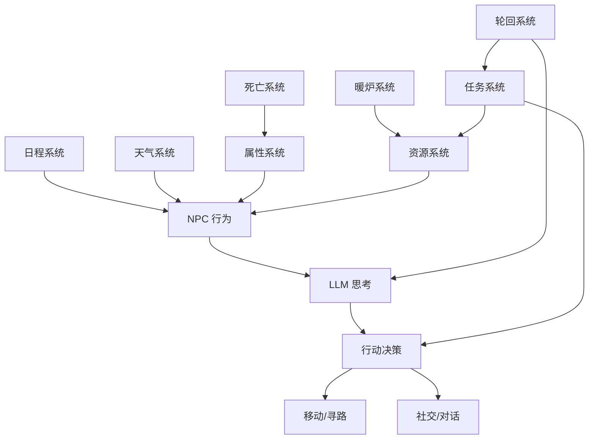

<p align="center">
  <h1 align="center">🥶 AI 游戏：福音雪镇</h1>
  <p align="center">
    <em>一款由 AI 驱动的像素风末日生存模拟 — 8 位自主 NPC 在 4 天极寒暴风雪中求生，由大语言模型实时推理驱动。</em>
  </p>
  <p align="center">
    <a href="./README.md">English</a> · 
    <a href="#快速开始">快速开始</a> · 
    <a href="#核心特性">核心特性</a> ·
    <a href="#系统架构">系统架构</a>
  </p>
  <p align="center">
    
    
    
    
    
  </p>
</p>

---

## 🎬 这是什么？

**福音雪镇** 是一款实时 AI 生存模拟游戏。你不是在*扮演*角色 — 你在**观察他们生活、思考、争吵、合作和死亡**。

八个陌生人被困在一个冰冻的村庄，气温在 4 天内从 -10°C 骤降至 -60°C。每个 NPC 都由大语言模型（LLM）驱动，实时产生思考、对话和生存决策。没有剧本，每次游玩都是一个全新的故事。

> *想象一下《漫漫长夜》遇上《矮人要塞》遇上《斯坦福生成式智能体》— 全都跑在浏览器里。*

### 🎯 核心循环

```
第1天 (-10°C)：发现危机。收集物资。建立信任。
第2天 (-25°C)：气温骤降。冲突浮现。资源告急。
第3天 (0°C，喘息日)：短暂的平静。全力为明天做准备。
第4天 (-60°C，暴风雪)：终极考验。不是所有人都能活下来。
```

如果所有人都死了 — 世界会**轮回重生**。NPC 带着前世的模糊记忆，在新的轮回中做出不同的选择。问题不是*能否*存活，而是*谁*能存活，以及*他们会变成什么样*。

---

## ✨ 核心特性

### 🧠 LLM 驱动的自主 NPC
- 8 个 NPC 各有独特的性格、背景故事、技能专长和家庭关系
- NPC 使用 LLM **独立思考** — 分析威胁、机会和社交动态
- 对话基于情境、心情和紧迫感自然涌现
- NPC 记住过往交互，对彼此形成好感或反感

### ❄️ 硬核生存系统
- **体温系统** — 暴露在 -25°C 以下导致失温 → 健康流失 → 死亡
- **饥饿系统** — 持续 4 小时挨饿后健康加速流失（约 11 分钟致死）
- **健康→死亡链路** — 多条件叠加：饥饿 + 失温 + 体力耗尽 = 快速死亡
- **濒死状态** — 健康值过低时 NPC 倒地求救（5 分钟救援窗口）
- **资源平衡** — 木柴、食物、电力、建材 — 必须精打细算对抗消耗

### 🔥 有意义的任务系统
- **暖炉建造** — 第二座暖炉需要真实的 NPC 劳动、材料和时间
- **无线电修理** — 进度追踪 0%→100%，完成后第 4 天可呼叫救援
- **药品制作** — 急救包可救治受伤 NPC（+20 健康值）
- **陷阱布置** — 激活夜间预警系统，提升全员士气
- **没有假任务** — 每个任务都产生可验证的、切实的游戏效果

### 🔄 轮回系统
- 全员死亡时世界重置但信息延续
- 每个轮回递增「世数」
- NPC 保留前世的微弱回忆，影响未来决策
- 不同的选择在轮回中自然涌现

### 🎨 像素风美学
- 程序化生成地图（村庄 + 9 个室内场景）
- 动态天气系统，带雪花粒子和温度可视化
- 冰霜暗色主题，末日生存氛围
- Y-Sort 渲染 + 独立气泡层系统

---

## 🚀 快速开始

### 方式一：本地服务器（推荐）

```bash
# 克隆仓库
git clone https://github.com/YOUR_USERNAME/AI_Game_Gospel_snow_town.git
cd AI_Game_Gospel_snow_town

# 启动服务
node server.js

# 在浏览器中打开
# http://localhost:8080
```

### 方式二：直接打开

```bash
# 直接在浏览器中打开 index.html（部分 LLM 功能可能需要服务器）
open index.html
```

### LLM 配置

游戏支持两种 LLM 后端：

| 模式 | API 地址 | 推荐场景 |
|------|----------|----------|
| **Ollama 本地**（推荐） | `localhost:11434/api/chat` | 本地 Qwen3-14B-Q8 |
| **云端 API** | OpenAI 兼容端点 | GLM-4-Flash（免费） |

```bash
# 使用 Ollama 本地模型：
OLLAMA_MODELS=/path/to/models OLLAMA_ORIGINS="*" ollama serve

# 拉取推荐模型
ollama pull qwen3:14b-q8_0
```

---

## 🏗️ 系统架构

```
gospel_snow_town/
├── index.html              # 入口页面（生存状态栏 + 资源面板）
├── game.js                 # 游戏主循环，集成所有子系统
├── npc.js                  # NPC 系统（AI 思考、移动、属性、日程）
├── maps.js                 # 程序化地图生成（村庄 + 9 个室内场景）
├── dialogue.js             # 对话系统（NPC↔NPC、玩家↔NPC，LLM 驱动）
├── weather-system.js       # 4 天温度循环 + 雪花粒子
├── resource-system.js      # 木柴/食物/电力/建材管理 + 天气消耗缩放
├── furnace-system.js       # 暖炉供暖 + 建造进度
├── task-system.js          # NPC 专长 + 每日任务分配
├── death-system.js         # 健康→死亡链路 + 4 种结局
├── reincarnation-system.js # 死亡→重生循环 + 记忆延续
├── event-system.js         # 冲突事件 + 调解机制
├── style.css               # 冰霜暗色主题样式
├── server.js               # Node.js 静态服务器
├── asset/                  # 8 个角色的精灵图 + 头像
└── guide/                  # 设计文档、更新日志、踩坑记录
```

### 核心系统流程



---

## 👥 8 位幸存者

| 角色 | 职业 | 专长 | 关系 |
|------|------|------|------|
| 🍳 **李婶** | 物资总管/炊事长 | 资源分配，照顾全员，热心精明 | 陆辰的妈妈 |
| 🪓 **赵铁柱** | 伐木工/锅炉工 | 木柴采集 ×1.5，沉默寡言行动力强 | 暗恋李婶 |
| ⚡ **王策** | 技师/规划师 | 发电机维修 ×2，暖炉扩建 ×1.5 | — |
| 🧓 **老钱** | 精神支柱/领导者 | 调解冲突 ×2，经验判断预警 | 清璇的爷爷 |
| 🏥 **苏岩** | 医疗专家 | 冻伤治疗 ×2，心理疏导 San 恢复 | — |
| 💪 **陆辰** | 采集/建造 | 建材 ×1.5，耐寒体温下降 ×0.7 | 李婶的儿子 |
| 🔍 **凌玥** | 侦察/急救/士气 | 废墟侦察稀有物资 ×2，士气恢复 | — |
| 🧪 **清璇** | 药剂/陷阱/无线电 | 草药制剂 ×1.5，无线电修理 | 老钱的孙女 |

---

## 🎮 如何"游玩"

这不是一款传统游戏 — 它是一个**活的模拟世界**。你观察，偶尔介入：

1. **观察** — NPC 基于 AI 推理自主决定行动
2. **点击 NPC** — 查看他们的状态、想法、健康值和当前任务
3. **对话** — 点击 NPC 开始交谈（你的话会影响他们的心情和决策）
4. **监控资源** — 顶部栏实时显示木柴、食物、电力、建材
5. **撑过 4 天** — 你的小镇能挺过 -60°C 的暴风雪吗？

### 小贴士
- 关注**第 3 天准备评估** — 它会告诉你是否为第 4 天做好了准备
- 如果 NPC 健康值低于 30 且没有食物和体力，会进入**濒死状态**
- 苏医生可以救活濒死的 NPC — 但前提是她能及时赶到
- 第二座暖炉对第 4 天至关重要 — 确保第 2 天就有人在建造它

---

## 📖 设计文档

详细的设计文档位于 `guide/` 目录：

| 文档 | 内容 |
|------|------|
| [01-design.md](guide/01-design.md) | 设计理念与项目定位 |
| [02-map.md](guide/02-map.md) | 地图布局与场景设计 |
| [03-npc.md](guide/03-npc.md) | NPC 性格、行为循环、发疯机制 |
| [04-attributes.md](guide/04-attributes.md) | 七大属性系统 + 死亡链路数值推演 |
| [05-ai.md](guide/05-ai.md) | LLM Prompt 工程与 AI 决策系统 |
| [06-tech.md](guide/06-tech.md) | 技术架构与核心类设计 |
| [08-changelog.md](guide/08-changelog.md) | 版本历史与 Bug 修复记录 |
| [09-pitfalls.md](guide/09-pitfalls.md) | 18 个踩坑记录 & 16 条开发原则 |

---

## 🔧 技术栈与开发原则

### 技术栈
- **前端**: 原生 JavaScript + HTML5 Canvas（零依赖）
- **AI 引擎**: LLM API（Ollama 本地 / OpenAI 兼容云端）
- **服务器**: Node.js 静态文件服务器（可选，用于 LLM 代理）
- **地图**: Canvas API 程序化生成（无需 Tiled/tilemap 编辑器）
- **寻路**: A* 算法 + BFS 目标修正

### 开发原则
1. **每个任务目标必须有可验证的游戏效果** — 不允许假装做事
2. **物资系统先设计消耗，再反推采集速率** — 不拍脑袋定数字
3. **健康/死亡链路必须有明确的数值推演** — 写代码前先算数学
4. **LLM 是不可靠的外部依赖** — 必须有 fallback、重试和熔断机制
5. **Debug 可观测性是核心基础设施** — 看不到就等于不存在

---

## 🌟 灵感来源

- 🤖 [斯坦福生成式智能体](https://github.com/joonspk-research/generative_agents) — LLM 驱动的自主智能体
- 🌾 [星露谷物语 (Stardew Valley)](https://www.stardewvalley.net/) — 像素风美学与 NPC 关系
- 🎵 [冰汽时代 (Frostpunk)](https://www.frostpunkgame.com/) — 冰雪城市生存与道德抉择

---

## 📄 开源协议

本项目采用 [Apache License 2.0](LICENSE) 协议。

```
Copyright 2026

Licensed under the Apache License, Version 2.0 (the "License");
you may not use this file except in compliance with the License.
You may obtain a copy of the License at

    http://www.apache.org/licenses/LICENSE-2.0

Unless required by applicable law or agreed to in writing, software
distributed under the License is distributed on an "AS IS" BASIS,
WITHOUT WARRANTIES OR CONDITIONS OF ANY KIND, either express or implied.
See the License for the specific language governing permissions and
limitations under the License.
```

---

<p align="center">
  <em>每一次游玩都是一个新故事。每一次死亡都是一堂课。每一次轮回都是一次机会。</em>
</p>
<p align="center">
  ⭐ 如果你觉得有趣，请给个 Star！
</p>
