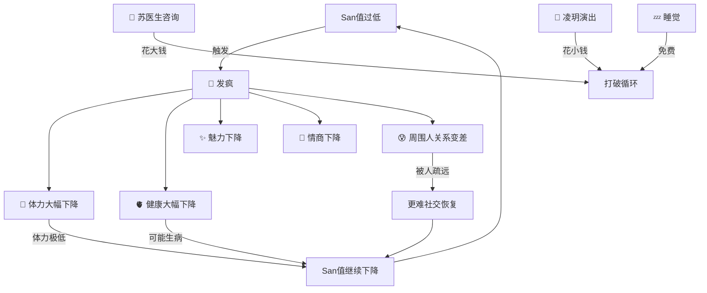
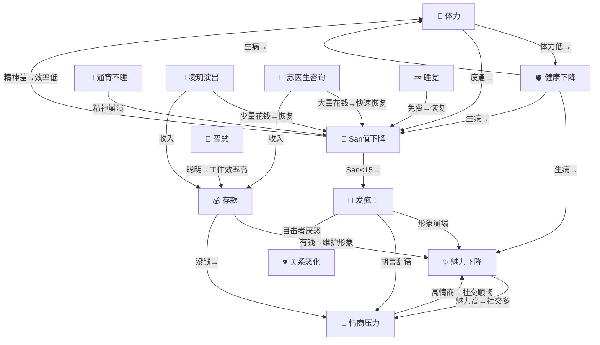

# 七大属性系统

## 属性总览

| 属性 | 英文 | 范围 | 含义 | 变化速度 |
|------|------|------|------|---------|
| 💪 **体力** | stamina | 0~100 | 每天工作/活动消耗，休息恢复。归零则无法工作 | ⚡快 |
| 🧠 **San值** | sanity | 0~100 | 精神状态（类似《饥荒》san值），通宵/劳累降低，睡眠/社交/娱乐恢复 | ⚡快 |
| 💰 **存款** | savings | 0~∞ | 金钱，通过工作赚取，消费花费 | 中等 |
| ✨ **魅力** | charisma | 0~100 | 社交吸引力，影响好感度增长速度和社交成功率 | 🐢慢 |
| 🧠 **智慧** | wisdom | 0~100 | 认知能力，影响可从事的工作和决策质量 | 🐢慢 |
| 🫀 **健康** | health | 0~100 | 身体状况，低了会生病，生病影响一切行为 | 🐢慢 |
| 💬 **情商** | empathy | 0~100 | 处理人际关系的能力，影响矛盾解决和社交深度 | 🐢慢 |

## 属性变化机制（缓慢变化模式）

属性采用**缓慢连续变化**设计，每帧根据当前行为微量增减，一天下来变化约 2~8 点。

### 体力 (stamina)

| 场景 | 变化率/秒 | 说明 |
|------|----------|------|
| 工作中（在工作场所） | -0.10 | 劳动消耗体力（变化快） |
| 清醒非工作 | -0.05 | 日常活动消耗 |
| 睡觉 | +0.12 | 睡眠恢复体力（只恢复不消耗） |
| 吃饭（在酒馆） | +0.08 | 吃饭直接恢复体力 |
| 新的一天 | +30（一次性） | 睡了一晚的恢复 |

**注意**：睡觉时体力只会恢复，不会下降。NPC也不会因为饿而睡不着。

**体力等级效果**：

| 体力值 | 状态 | 移动速度 |
|--------|------|---------|
| 80~100 | 精力充沛 | ×1.2 |
| 50~79 | 正常 | ×1.0 |
| 20~49 | 疲惫 | ×0.7 |
| 0~19 | 虚脱 | ×0.4 |

### 存款 (savings)

| 来源 | 金额 | 说明 |
|------|------|------|
| 日薪（有工作场所） | +30/天 | 每天重置时结算 |
| 退休金（55岁以上无工作） | +20/天 | 退休金 |
| 工作时持续收入 | +0.05~0.08/秒 | 在工作场所时 |
| 吃饭（外出就餐） | -0.5/秒 | 在酒馆/杂货铺吃饭时（≈10元/顿） |
| 大厨餐饮收入 | +0.4/秒（每位客人） | 客人在酒馆吃饭时赵大厨获得收入 |
| 看病 | -0.1/秒 | 在医院看病时 |
| 零花钱（家长→孩子） | +5~10/天 | 李婶→陆辰，老钱→清璇，每天结算 |

### 魅力 (charisma)【变化慢】

| 行为 | 变化率 | 说明 |
|------|--------|------|
| 社交中 | +0.005/秒 | 聊天时缓慢提升 |
| 存款>200 | +0.002/秒 | 有钱维护形象 |
| 生病 | -0.005/秒 | 病恹恹的 |
| 体力<20 | -0.005/秒 | 疲惫颓废 |
| 对话成功 | +1/次 | 事件驱动 |
| 冲突 | -3/次 | 事件驱动 |

### 智慧 (wisdom)【变化慢】

| 行为 | 变化率 | 说明 |
|------|--------|------|
| 在学堂 | +0.004/秒 | 上课/教课 |
| 在公园长椅附近 | +0.002/秒 | 读书/思考 |
| 向更聪明的人学习 | +1/次 | 事件驱动 |

### 健康 (health)

| 行为 | 变化率 | 说明 |
|------|--------|------|
| 白天+体力正常 | +0.005/秒 | 正常维持 |
| 睡觉（健康<80） | +0.02/秒 | 睡眠恢复 |
| 吃饭 | +0.01/秒 | 营养补充 |
| 体力<10 | -0.02/秒 | 过劳伤身 |
| 淋雨 | -0.03/秒 | 可能感冒 |
| 年龄≥60 | -0.003/秒 | 自然衰老 |
| 深夜不睡 | -0.01/秒 | 熬夜伤身 |
| 医院看病 | +0.1/秒 | 花钱治疗 |

**生病机制**：
- 健康<30 时，有概率触发生病
- 生病持续约 2 游戏小时
- 生病期间：体力-0.02/秒，魅力-0.005/秒
- 康复条件：计时结束 或 健康恢复到50以上

**【v2.0】健康→死亡链路**：

| 状态 | 健康扣减速率 | 从100到0所需时间 |
|------|------------|----------------|
| 仅饱腹=0（持续>4小时后） | 0.15/秒 | ~11分钟 |
| 仅体力=0 | 0.025/秒 | ~67分钟 |
| 饱腹=0 + 体力=0 | 0.175/秒 | ~9.5分钟 |
| 严重失温(<33°C持续>30分钟) | 0.2/秒 | ~8.3分钟 |
| 生病中 | 0.033/秒 | ~50分钟 |
| 多条件叠加（饱腹0+体力0+生病） | 0.208/秒 | ~8分钟 |

**濒死状态（v2.0新增）**：
- 触发条件：饱腹=0 AND 体力=0 AND 健康<30
- 濒死表现：NPC停止所有活动、倒地、发出求救信号
- 濒死超时：5分钟内无人救助（苏医生/急救包）→ 标记死亡
- 死亡时触发全员悲痛事件（San-10），UI显示死因详情

**失温致死（v2.0新增）**：
- 体温<33°C持续>30分钟 → 健康扣减0.2/秒（严重失温快速致死）
- 体温<34°C时P0层立即导航到最近室内入口
- 体温<35°C时触发紧急返回暖炉

**饱腹值（hunger）— v2.0极寒生存属性**：

| 状态 | 效果 |
|------|------|
| 饱腹>60 | 正常状态 |
| 饱腹20~60 | 轻度饥饿，体力恢复减慢 |
| 饱腹<20 | 严重饥饿，暖炉旁体力恢复×0.5 |
| 饱腹=0 | 健康持续下降（0.05/秒，4h后加速到0.15/秒），触发饥饿行为 |
| 饱腹=0超过4小时 | 健康扣减加速至0.15/秒，约11分钟从100降到0 |

**体温（bodyTemp）— v2.0极寒生存属性**：

| 体温范围 | 状态 | 效果 |
|----------|------|------|
| 36~37°C | 正常 | 无额外效果 |
| 35~36°C | 轻度失温 | 移动减速，San轻微下降 |
| 34~35°C | 中度失温 | P0紧急返回暖炉，San加速下降 |
| 33~34°C | 重度失温 | P0寻找最近室内入口，健康开始下降 |
| <33°C | 严重失温 | 持续>30分钟后健康扣减0.2/秒，快速致死 |

### 情商 (empathy)【变化慢】

| 行为 | 变化率 | 说明 |
|------|--------|------|
| 社交中 | +0.004/秒 | 聊天练习共情 |
| 对话成功 | +0.5/次 | 事件驱动 |
| 对话失败 | -1/次 | 事件驱动 |

### 🧠 San值 (sanity)【变化快】— 类似《饥荒》

San值代表NPC的**精神状态**，类似《饥荒》中的理智值。通宵不睡觉是San值下降的最大原因，睡眠是恢复的主要途径。

**San值下降**：

| 行为 | 变化率 | 说明 |
|------|--------|------|
| **通宵不睡（23:00~5:00）** | **-0.15/秒** | **⚠️ 最大惩罚！不睡觉精神崩溃** |
| 工作中 | -0.08/秒 | 劳累消耗精神 |
| 清醒时自然衰减 | -0.02/秒 | 日常需要持续休息/社交来恢复 |
| 体力<20 | -0.06/秒 | 疲惫导致精神差 |
| 生病 | -0.05/秒 | 身体不适影响精神 |
| 饥饿<30 | -0.04/秒 | 饿肚子精神差 |

**San值恢复（三大途径）**：

| 途径 | 变化率 | 花费 | 说明 |
|------|--------|------|------|
| 💤 **睡觉** | **+0.06/秒** | 免费 | 主要恢复途径（慢但免费） |
| 🎵 **看凌玥演出** | **+0.20/秒** | ~1元/次（少量） | 14:00-16:00广场 / 19:00-21:00酒馆驻唱 |
| 💬 **苏医生心理咨询** | **+0.30/秒** | ~6元/次（大量） | 需去医院+苏医生在岗+存款≥10 |
| 社交聊天 | +0.12/秒 | 免费 | 和人聊天恢复精神 |
| 吃饭 | +0.06/秒 | 需付餐费 | 享受美食 |
| 散步（户外非工作） | +0.02/秒 | 免费 | 在村庄闲逛放松 |
| 酒馆有凌玥（非演出时间） | +0.03/秒 | 免费 | 凌玥在酒馆时的氛围恢复 |
| 新的一天 | +15（一次性） | — | 新一天的精神重置 |

**凌玥演出经济**：
- 凌玥在演出时间（14:00-16:00广场、19:00-21:00酒馆），同场景的NPC会自动观看
- 观众每次花费约1元（少量），凌玥获得0.04/秒收入
- 演出提供的San值恢复（+0.20/秒）远超普通社交

**苏医生心理咨询经济**：
- NPC在医院且苏医生在岗时自动触发咨询
- 咨询费用约6元/次（大量花钱），苏医生获得0.25/秒收入
- 咨询提供最强San值恢复（+0.30/秒）

**San值等级**：

| San值 | 等级 | 影响 |
|-------|------|------|
| 80~100 | 神清气爽 | NPC积极社交，思维清晰 |
| 60~79 | 精神不错 | 正常状态 |
| 40~59 | 有些疲惫 | 有点蔫 |
| 20~39 | 精神萎靡 | 需要休息，可能出现消极言论 |
| 15~19 | 精神崩溃 | 无法正常工作，效率极低 |
| **0~14** | **🤯 发疯！** | **随机乱走、说胡话、无法工作/社交** |

**发疯机制（San值<15触发）**：
- San值<15时有概率触发发疯状态（`isCrazy=true`）
- 发疯持续约3游戏小时
- **发疯表现**：
  - 随机乱走（不执行日程/社交）
  - 随机说胡话（"嘿嘿嘿…"、"别过来！"、"哈哈哈哈！"等）
  - 💪 体力持续下降（**-0.08/秒**）
  - 🫀 健康持续下降（**-0.03/秒**）
  - ✨ 魅力持续下降（**-0.02/秒**，形象崩塌）
  - 💬 情商持续下降（**-0.01/秒**，胡言乱语损伤社交能力）
- **关系恶化**（连锁社交惩罚）：
  - 同场景的NPC会"目睹"发疯行为
  - 目击者对发疯者好感度 **-2**（害怕/厌恶）
  - 发疯者对目击者好感度 **-1**（精神混乱产生敌意）
  - 事件日志提示：`😰 xxx 目睹了 xxx 的疯狂行为，关系变差了`
- **恢复条件**：San值回到30以上 或 发疯计时结束
- **恢复方法**：去医院找苏医生（最快）、去看凌玥演出、好好睡觉

**发疯恶性循环**：

**设计理念**：
- 通宵不睡觉是San值下降最快的方式（-0.15/秒），模拟《饥荒》中夜晚掉san的机制
- 睡眠是恢复San值的免费途径（+0.06/秒），但速度中等
- 凌玥演出是性价比最高的恢复方式（+0.20/秒，少量花钱）
- 苏医生咨询是最快的恢复方式（+0.30/秒，但大量花钱）
- San值过低会导致发疯，需要紧急治疗
- 第二天精神状态取决于前一晚是否好好睡觉

## 属性联动关系

## 8 个角色初始属性

| 角色 | 💪体力 | 🧠San | 💰存款 | ✨魅力 | 🧠智慧 | 🫀健康 | 💬情商 | 设计理由 |
|------|-------|-------|--------|-------|--------|--------|--------|---------|
| 李婶(42) | 60 | 70 | 350 | 75 | 45 | 55 | 80 | 杂货铺老板，热心健谈→魅力高+情商高；陆辰的妈妈 |
| 赵大厨(38) | 85 | 70 | 280 | 55 | 35 | 75 | 50 | 酒馆老板，体力劳动者→体力高+健康好；粗犷→智慧较低 |
| 王老师(32) | 50 | 70 | 200 | 65 | 90 | 60 | 70 | 哲学教师→智慧极高；不爱运动→体力偏低 |
| 老钱(60) | 35 | 70 | 500 | 70 | 85 | 40 | 75 | 退休镇长/智囊→智慧高+存款丰厚；年迈→体力低+健康差；清璇的爷爷 |
| 苏医生(35) | 55 | 70 | 200 | 55 | 75 | 80 | 70 | 镇医+心理咨询师→智慧较高+健康好+情商高 |
| 凌玥(22) | 55 | 70 | 120 | 85 | 60 | 65 | 60 | 文艺演出/情绪疗愈师→魅力极高；San值恢复核心 |
| 陆辰(18) | 90 | 70 | 10 | 65 | 50 | 95 | 25 | 李婶的儿子，体力爆棚+健康极好；说话不过脑→情商很低 |
| 清璇(16) | 70 | 70 | 20 | 35 | 70 | 75 | 30 | 老钱的孙女，内向→魅力低；文学少女→智慧较高 |

## 属性注入 AI Prompt

属性信息以两种方式注入 NPC 的 `think()` Prompt：

1. **systemPrompt** 中注入属性提示（如"你精神状态很差，急需休息"、"你最近手头很紧"等），让 AI 的言行受属性影响
2. **userPrompt** 中注入属性概览字符串，如 `💪体力:60(正常) 🧠San:70(精神不错) 💰存款:350(小康) ✨魅力:75(有亲和力) ...`

## UI 展示

- **侧边栏卡片**：每个 NPC 卡片下方显示迷你属性条（7个彩色进度条，体力+San值+存款+魅力+智慧+健康+情商）
- **详情面板**：新增"📊 属性"Tab（默认显示），以网格展示属性卡片 + 进度条 + 等级描述 + 状态提示