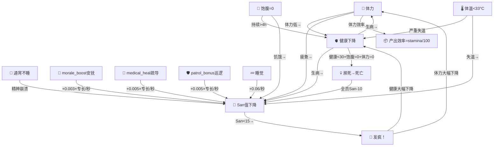

# 五大属性系统（v2.0 末日生存版）

## 属性总览

| 属性 | 英文 | 范围 | 含义 | 变化速度 |
|------|------|------|------|---------|
| 💪 **体力** | stamina | 0~100 | 每天工作/活动消耗，休息恢复。归零则无法工作 | ⚡快 |
| 🧠 **San值** | sanity | 0~100 | 精神状态（类似《饥荒》san值），通宵/劳累降低，睡眠/安抚恢复 | ⚡快 |
| 🫀 **健康** | health | 0~100 | 身体状况，低了会生病/濒死/死亡 | 🐢慢 |
| 🍖 **饱腹** | hunger | 0~100 | 饱腹度，不吃饭持续下降，归零后健康加速下降 | ⚡快 |
| 🌡️ **体温** | bodyTemp | 33~37°C | 体温，户外/暖炉故障时下降，失温可致死 | 中等 |

> v2.0末日生存版不再包含存款(savings)、魅力(charisma)、智慧(wisdom)、情商(empathy)属性。经济系统已被**资源系统**（木柴/食物/建材/电力）取代。

---

## 属性变化机制（缓慢变化模式）

属性采用**缓慢连续变化**设计，每帧根据当前行为微量增减，一天下来变化约 2~8 点。

### 💪 体力 (stamina)

| 场景 | 变化率/游戏秒 | 说明 |
|------|-------------|------|
| 工作中（在工作场所） | -0.10 | 劳动消耗体力 |
| 清醒非工作 | -0.05 | 日常活动消耗 |
| 睡觉 | +0.12 | 睡眠恢复体力（只恢复不消耗） |
| 吃饭（在炊事房） | +0.08 | 吃饭直接恢复体力 |
| 新的一天 | +30（一次性） | 睡了一晚的恢复 |
| 安抚/鼓舞（morale_boost行为） | -0.002 | 安抚他人消耗自身体力 |

**注意**：睡觉时体力只会恢复，不会下降。

**体力等级效果**：

| 体力值 | 状态 | 移动速度 | 产出效率 |
|--------|------|---------|---------|
| 80~100 | 精力充沛 | ×1.2 | 80%~100% |
| 50~79 | 正常 | ×1.0 | 50%~79% |
| 20~49 | 疲惫 | ×0.7 | 20%~49% |
| 0~19 | 虚脱 | ×0.4 | ≤19% |

> 体力效率 = stamina / 100，直接作为所有产出计算的乘数。

### 🫀 健康 (health)

| 行为 | 变化率/游戏秒 | 说明 |
|------|-------------|------|
| 白天+体力正常 | +0.005 | 正常维持 |
| 睡觉（健康<80） | +0.02 | 睡眠恢复 |
| 吃饭 | +0.01 | 营养补充 |
| 体力<10 | -0.02 | 过劳伤身 |
| 年龄≥60 | -0.003 | 自然衰老 |
| 深夜不睡 | -0.01 | 熬夜伤身 |
| medical_heal同场景 | +0.01×专长倍率 | 苏岩坐诊/巡查治疗 |
| medical_heal全局光环 | +0.005 | 不同场景的存活NPC被动恢复 |
| 急救包（苏岩使用） | +50（一次性） | 苏岩medical_treatment专长翻倍 |
| 急救包（其他人使用） | +25（一次性） | 基础恢复量 |

**生病机制**：
- 健康<30 时，有概率触发生病
- 生病持续约 2 游戏小时
- 生病期间：体力-0.02/秒，健康-0.033/秒
- 康复条件：计时结束 或 健康恢复到50以上

**【v2.0】健康→死亡链路**：

| 状态 | 健康扣减速率/游戏秒 | 从100到0所需时间 |
|------|-------------------|----------------|
| 仅饱腹=0（持续>4小时后） | 0.15 | ~11分钟 |
| 仅体力=0 | 0.025 | ~67分钟 |
| 饱腹=0 + 体力=0 | 0.175 | ~9.5分钟 |
| 严重失温(<33°C持续>30分钟) | 0.2 | ~8.3分钟 |
| 生病中 | 0.033 | ~50分钟 |
| 多条件叠加（饱腹0+体力0+生病） | 0.208 | ~8分钟 |

**濒死状态**：
- 触发条件：饱腹=0 AND 体力=0 AND 健康<30
- 濒死表现：NPC停止所有活动、倒地、发出求救信号
- 濒死超时：5分钟内无人救助（急救包）→ 标记死亡
- 死亡时触发全员悲痛事件（San-10），UI显示死因详情

### 🍖 饱腹值 (hunger) — v2.0极寒生存属性

| 状态 | 效果 |
|------|------|
| 饱腹>60 | 正常状态 |
| 饱腹20~60 | 轻度饥饿，体力恢复减慢 |
| 饱腹<20 | 严重饥饿，暖炉旁体力恢复×0.5 |
| 饱腹=0 | 健康持续下降（0.05/秒，4h后加速到0.15/秒），触发饥饿行为 |
| 饱腹=0超过4小时 | 健康扣减加速至0.15/秒，约11分钟从100降到0 |

### 🌡️ 体温 (bodyTemp) — v2.0极寒生存属性

| 体温范围 | 状态 | 效果 |
|----------|------|------|
| 36~37°C | 正常 | 无额外效果 |
| 35~36°C | 轻度失温 | 移动减速，San轻微下降 |
| 34~35°C | 中度失温 | P0紧急返回暖炉，San加速下降 |
| 33~34°C | 重度失温 | P0寻找最近室内入口，健康开始下降 |
| <33°C | 严重失温 | 持续>30分钟后健康扣减0.2/秒，快速致死 |

**失温致死**：
- 体温<33°C持续>30分钟 → 健康扣减0.2/秒（严重失温快速致死）
- 体温<34°C时P0层立即导航到最近室内入口
- 体温<35°C时触发紧急返回暖炉

### 🧠 San值 (sanity) — 类似《饥荒》

San值代表NPC的**精神状态**，类似《饥荒》中的理智值。通宵不睡觉是San值下降的最大原因，睡眠是恢复的主要途径。

**San值下降**：

| 行为 | 变化率/游戏秒 | 说明 |
|------|-------------|------|
| **通宵不睡（23:00~5:00）** | **-0.15** | **⚠️ 最大惩罚！不睡觉精神崩溃** |
| 工作中 | -0.08 | 劳累消耗精神 |
| 清醒时自然衰减 | -0.02 | 日常需要持续休息/安抚来恢复 |
| 体力<20 | -0.06 | 疲惫导致精神差 |
| 生病 | -0.05 | 身体不适影响精神 |
| 饥饿<30 | -0.04 | 饿肚子精神差 |
| 有人死亡 | -10（一次性） | 全员悲痛事件 |

**San值恢复（末日版途径）**：

| 途径 | 变化率/游戏秒 | 说明 |
|------|-------------|------|
| 💤 **睡觉** | **+0.06** | 主要恢复途径（慢但免费） |
| 💬 **morale_boost安抚** | **+0.003×专长/秒** | 老钱专长×2.0 → +0.006/秒（≈21.6/h） |
| 🏥 **medical_heal疏导** | **+0.005×专长/秒** | 苏岩medical_treatment专长×1.5 → +0.0075/秒（≈27/h） |
| 🛡️ **patrol_bonus巡逻** | **+0.005×专长/秒** | 陆辰patrol专长×1.5 → +0.0075/秒（≈27/h） |
| 💬 社交聊天 | +0.12 | 和人聊天恢复精神 |
| 🍖 吃饭 | +0.06 | 享受食物 |
| 🚶 散步（户外非工作） | +0.02 | 在据点闲逛放松 |
| 🌅 新的一天 | +15（一次性） | 新一天的精神重置 |

**San值等级**：

| San值 | 等级 | 影响 |
|-------|------|------|
| 80~100 | 神清气爽 | NPC积极社交，思维清晰 |
| 60~79 | 精神不错 | 正常状态 |
| 40~59 | 有些疲惫 | 有点蔫 |
| 20~39 | 精神萎靡 | 需要休息，可能出现消极言论 |
| 15~19 | 精神崩溃 | 无法正常工作，效率极低 |
| **0~14** | **🤯 发疯！** | **随机乱走、说胡话、无法工作/社交** |

**发疯机制（San值<15触发）**：
- San值<15时有概率触发发疯状态（`isCrazy=true`）
- 发疯持续约3游戏小时
- **发疯表现**：
  - 随机乱走（不执行日程/社交）
  - 随机说胡话（"嘿嘿嘿…"、"别过来！"、"哈哈哈哈！"等）
  - 💪 体力持续下降（-0.08/秒）
  - 🫀 健康持续下降（-0.03/秒）
- **恢复条件**：San值回到30以上 或 发疯计时结束
- **恢复方法**：睡觉、被安抚（morale_boost）、被医疗（medical_heal心理疏导）

---

## 行动效果数值速查表（ACTION_EFFECT_MAP）

NPC日程中的行为描述通过关键词匹配到以下效果类型，每个效果的实际产出 = 基础速率 × 体力效率(stamina/100) × 专长倍率 × 电力加成。

### 资源产出类 (produce_resource)

| 行为关键词 | 资源类型 | 基础速率 | 场景要求 | 气泡示例 |
|-----------|---------|---------|---------|---------|
| 砍柴/伐木/搬运木柴 | 🪵 woodFuel | 10/h | village | 🪓 砍柴中（木柴+X/h） |
| 采集食物/捕鱼/搜索罐头 | 🍖 food | 8/h | village | 🎣 采集食物中（食物+X/h） |
| 采集建材/收集建材/废墟 | 🧱 material | 5/h | village | 🧱 采集建材中（建材+X/h） |
| 维修发电机/检查发电机/技术工作/制造工具 | ⚡ power | 8/h | workshop | 🔧 维修发电机中（⚡+X/h） |
| 修理工具 | ⚡ power | 4/h | workshop | 🔧 修理工具中（⚡+X/h） |

> X = 基础速率 × (stamina/100) × 专长倍率 × 电力加成

### 建造进度类 (build_progress)

| 行为关键词 | 效果 | 场景要求 | 说明 |
|-----------|------|---------|------|
| 暖炉扩建/设计暖炉/协助建造/扩建/整理图纸/规划 | 推进暖炉建造进度 | workshop | 王策(furnace_build专长)在工坊时自动启动建造 |

### 制作急救包 (craft_medkit)

| 行为关键词 | 效果 | 场景要求 | 说明 |
|-----------|------|---------|------|
| 制作草药/急救包/草药制剂/制药/整理药品 | 每2游戏小时产出1份急救包 | medical | 产出速率受体力效率×专长倍率×电力加成影响 |

> 急救包为独立消耗品，全局自动检查：任何NPC健康<50时自动使用。苏岩(medical_treatment)使用恢复+50HP，其他人+25HP。

### 修理无线电 (repair_radio)

| 行为关键词 | 效果 | 场景要求 | 说明 |
|-----------|------|---------|------|
| 修理无线电/无线电台 | 8游戏小时完成修理 | workshop | 修好后可向外界求救，受体力效率×专长倍率影响 |

### 减少浪费 (reduce_waste)

| 行为关键词 | 效果 | 场景要求 | 说明 |
|-----------|------|---------|------|
| 盘点物资/整理库存/管理物资/物资分配/搬运/整理物资 | 食物浪费-20%，木柴浪费-10%，等效食物+3/h | warehouse | 标记持续1游戏小时 |
| 做早餐/准备早餐/准备晚餐/分配食物/准备午餐/准备明日食材 | 同上 | kitchen | 同上 |

### 医疗救治 (medical_heal)

| 行为关键词 | 效果 | 场景要求 | 说明 |
|-----------|------|---------|------|
| 坐诊/治疗冻伤/心理疏导/巡查伤员/医疗救治/处理伤员 | 同场景NPC健康+0.01/秒×专长，San+0.005/秒×专长 | medical | 苏岩medical_treatment×1.5 |
| 巡查 | 同上 | 不限 | 苏岩暖炉广场巡查等不限场景 |

> 附带全局光环：不在同场景的存活NPC也能获得+0.005/秒的健康恢复。

### 暖炉维护 (furnace_maintain)

| 行为关键词 | 效果 | 场景要求 | 说明 |
|-----------|------|---------|------|
| 维护暖炉/添加柴火 | 暖炉消耗-10%（燃料节约） | 不限 | 设置标记，影响暖炉燃料消耗 |

### 巡逻警戒 (patrol_bonus)

| 行为关键词 | 效果 | 场景要求 | 说明 |
|-----------|------|---------|------|
| 巡逻/警戒/安全巡查/巡视/陷阱/警报 | 全队San恢复+10%，同场景San+0.005/秒×专长 | village | 陆辰patrol专长×1.5 |

### 安抚鼓舞 (morale_boost)

| 行为关键词 | 效果 | 场景要求 | 说明 |
|-----------|------|---------|------|
| 安抚/调解冲突/统筹/鼓舞/讲故事/安慰/心理支持/协调/谈心 | 同场景NPC San+0.003/秒×专长 | 不限 | 老钱morale_boost×2.0；消耗体力-0.002/秒；体力<15时停止 |

---

## 属性联动关系

---

## 8 个角色初始属性

| 角色 | 💪体力 | 🧠San | 🫀健康 | 🍖饱腹 | 🌡️体温 | 设计理由 |
|------|-------|-------|--------|-------|--------|---------|
| 李婶(42) | 60 | 65 | 55 | 80 | 36.5 | 物资总管，热心健谈，体力中等 |
| 赵铁柱(38) | 90 | 70 | 75 | 80 | 36.5 | 伐木工+锅炉工，体力劳动者→体力高+健康好 |
| 王策(32) | 50 | 70 | 60 | 80 | 36.5 | 技师，脑力型→体力偏低 |
| 老钱(60) | 30 | 80 | 40 | 80 | 36.5 | 镇长/精神领袖，年迈→体力极低+健康差，但San值高 |
| 苏岩(35) | 55 | 75 | 80 | 80 | 36.5 | 医官，半天坐诊+半天采集，健康好 |
| 凌玥(22) | 60 | 55 | 70 | 80 | 36.5 | 侦察员/急救兵，初始San较低易情绪波动 |
| 陆辰(18) | 95 | 60 | 95 | 80 | 36.5 | 采集工/建筑工，体力爆棚+健康极好，但San偏低 |
| 清璇(16) | 40 | 50 | 65 | 80 | 36.5 | 药剂师学徒，体力差+初始San最低 |

---

## 属性注入 AI Prompt

属性信息以两种方式注入 NPC 的 `think()` Prompt：

1. **systemPrompt** 中注入属性提示（如"你精神状态很差，急需休息"、"你快饿死了"等），让 AI 的言行受属性影响
2. **userPrompt** 中注入属性概览字符串，如 `💪体力:60(正常) 🧠San:70(精神不错) 🫀健康:80(健康) 🍖饱腹:65(正常) 🌡️体温:36.5°C(正常)`

## UI 展示

- **侧边栏卡片**：每个 NPC 卡片下方显示迷你属性条（5个彩色进度条：体力+San值+健康+饱腹+体温）
- **详情面板**：新增"📊 属性"Tab（默认显示），以网格展示属性卡片 + 进度条 + 等级描述 + 状态提示
- **资源面板**：顶部显示全局资源（🪵木柴 / 🍖食物 / 🧱建材 / ⚡电力 / 💊急救包）
- **动态气泡**：NPC头顶显示当前行动效果的实时数值（如"🪓 砍柴中（木柴+12.0/h）"）
