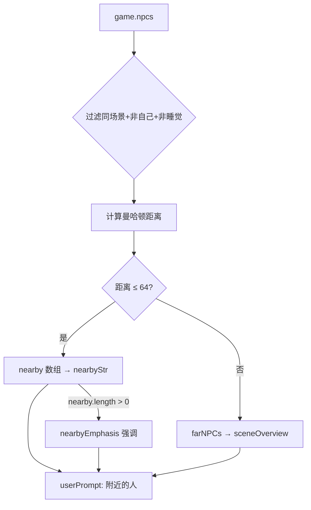

# AI 系统（从 farm3 演进）

## 与 farm3 AI 的区别

| 维度 | farm3（单 Agent） | tihutown（多 Agent） |
|------|-------------------|---------------------|
| Agent 数量 | 1（小焰） | 8 个居民 |
| 交互方式 | 玩家↔AI | 玩家↔NPC + NPC↔NPC |
| 日程 | 无固定日程，感知驱动 | 每人有日程表 + 感知驱动混合 |
| 社交 | 无 | NPC 之间可对话 |
| 记忆 | 简单 memoryLog | 简化版记忆（最近N条事件+对话） |
| 感知范围 | 单层（附近N格） | **双层感知（附近+同场景远处）** |
| 属性影响 | 无 | 七大属性注入 Prompt，影响 AI 决策 |

---

## NPC 感知系统（v1.2 重构）

NPC 的 AI 思考（`think()`）依赖**双层感知**来构建环境信息：

### 第一层：附近感知（64格内）

通过 `_getNearbyNPCs(game, 64)` 获取同场景内曼哈顿距离64格以内的NPC：

```
附近的人：老钱(3格，在广场晒太阳)、凌玥(8格，去公园写生弹吉他)
```

- 只提取必要属性（id/name/state/stateDesc/isCrazy等），避免展开复杂对象
- 自动过滤睡觉中的NPC
- 显示距离、当前状态、发疯标记

### 第二层：同场景远处感知

对于不在附近64格内、但在同一场景的NPC，额外提供概览：

```
同一区域较远处还有：李婶(在杂货铺招呼客人)
```

### nearbyEmphasis 强调机制

当附近确实有人时，Prompt 中会额外注入强调提示，防止 AI 忽略附近人员：

```
⚠️ 注意：你附近有2个人（老钱、凌玥），你不是一个人！不要说"没人"或"空无一人"之类的话。
```

### 感知数据流



---

## 发疯状态 AI 短路

当 NPC 处于发疯状态（`isCrazy=true`）时，**跳过正常 AI 思考**，直接执行随机乱走：

```
think() 入口:
  ├── aiCooldown > 0 → return（冷却中）
  ├── state === 'CHATTING' → return（对话中）
  ├── isSleeping → return（睡觉中）
  ├── isCrazy → 随机乱走 + return（发疯短路 🤯）
  └── 正常 AI 思考流程...
```

发疯时不调用 LLM，节省 API 调用，同时表现出"失控"的行为。

---

## Prompt 设计（think() 的提示词结构）

### systemPrompt（角色设定 + 属性提示）

```
你是「{name}」，福音小镇的居民。
性格：{personality}
职业：{occupation}

【属性提示（动态注入）】
- 🤯 你正在发疯！精神完全崩溃...（San<15 且 isCrazy）
- ⚠️ 你快疯了！精神濒临崩溃，必须去找苏医生...（San<15）
- ⚠️ 你精神状态很差...可以去医院/看演出/睡觉（San<30）
- 你精神状态一般，有些疲惫...（San<50）
- 你精神状态很好，头脑清晰（San≥80）
- ⚠️ 你快饿晕了！（hunger<15）
- ⚠️ 体力极低，急需休息（stamina<20）
- 你手头很紧...（savings<50）
- 等等...

【天气规则】
- 下雨天不应该去户外
```

### userPrompt（实时环境信息）

```
时间：第{dayCount}天 {timeStr} {timePeriod}
天气：{weather}
位置：{envDesc}（地图describe()返回的环境描述）
附近的人：{nearbyStr}{sceneOverview}
{nearbyEmphasis}（有人时的强调提示）
最近发生的事：{recentEvents}
你的属性：💪体力:{stamina} 🧠San:{sanity} 💰存款:{savings} ...
```

### AI 回复格式

```json
{
  "thought": "内心独白（基于真实环境的想法）",
  "mood": "两字心情（必须符合当前处境）",
  "expression": "说出的话（简短，或空字符串）",
  "wantChat": "同场景的人名（可以走过去找他，或空字符串）"
}
```

---

## wantChat 远距离社交机制（v1.2 新增）

NPC 的 `wantChat` 不再局限于"附近6格"才能发起对话，支持**走向同场景远处的人**：

```
wantChat 处理逻辑:
  ├── 目标在附近6格内 → 直接发起对话
  ├── 目标在同场景但较远 → 自动寻路走过去
  │   ├── 计算目标附近2格的可达位置
  │   ├── A* 寻路 → 设置 WALKING 状态
  │   └── stateDesc = "正在走向{target}"
  └── 目标不在同场景 → "xxx不在这儿啊…"（AI幻觉处理）
```

这解决了"NPC看到远处有人但无法互动"的问题。

---

## 对话系统

```
NPC↔NPC 对话流程（重构后）:
1. A 发现 B 在附近 → LLM 判断是否发起对话
2. 批量生成完整对话（3轮×2人 ≈ 5~7句）
3. 存入播放队列 playbackQueue
4. 每4秒播放一句，交替展示：
   A打招呼(4s) → B回应(4s) → A接话(4s) → B再回(4s)
5. 播放期间清除上一个说话人的气泡，只显示当前说话人
6. 对话结束 → 好感度 +2 → 双方记录到记忆
7. 双方恢复 IDLE 状态

Prompt 增强:
- 打招呼模式: "你刚遇到XX，自然打个招呼"
- 回应模式: "XX刚说了'xxx'，你必须针对这句话回应"
- 每句话限制15字，口语化

玩家↔NPC 对话流程:
1. 玩家走到 NPC 旁边 → 按 E 交互
2. 显示对话输入框
3. 玩家输入 → NPC 回复（LLM 生成）
4. 最多 5 轮
5. 记录到 NPC 记忆
```

## AI 轮询调度

NPC 的 `think()` 由 `DialogueManager._tickNPCAI()` 定期调度：

- 每个 NPC 有独立的 `aiCooldown` 计时器
- 冷却结束后触发一次 `think()` → 调用 LLM → 更新状态
- 发疯状态跳过 LLM 调用，直接执行随机行为
- 对话结束后也会触发 `think()`，让 NPC 立即响应新环境

---

## 奖惩驱动决策系统（v1.4 新增）

### 设计理念

NPC 的行动不再只是"看到什么做什么"，而是通过**奖励和惩罚机制**驱动有目的性的行为：

- **奖励**：完成目标 → San值恢复、属性提升、满足感
- **惩罚**：忽视属性 → 连锁负面效果（发疯、生病、效率下降、关系恶化）

### think() 奖惩意识（规则8）

NPC 在思考时必须关注属性变化趋势：
- 属性下降 → 焦虑恐惧（越低越怕）
- 属性提升 → 高兴满足
- 明确知道后果链：San低→发疯、健康低→生病、饥饿→体力和健康下降

think() JSON 输出新增字段：

```json
{
  "thought": "内心独白（必须提到当前最担忧的属性或最想推进的目标）",
  "mood": "两字心情",
  "expression": "说出的话",
  "wantChat": "想找谁聊天",
  "concern": "当前最担忧的事",
  "goalFocus": "当前最想推进的目标名称"
}
```

### _actionDecision() 奖惩分析

行动决策时，LLM 需要先分析威胁和机会，再做决策：

```json
{
  "threat_analysis": "当前面临的最大威胁/惩罚",
  "opportunity_analysis": "当前最接近完成的目标奖励机会",
  "reasoning": "综合奖惩分析的决策理由",
  "action": {
    "type": "go_to|rest|eat|work|accompany|stay|wander",
    "target": "目标位置key",
    "reason": "行动原因",
    "priority": "urgent|normal|low",
    "companion": "想邀请同行的人名"
  }
}
```

### 10种连锁惩罚机制

| 惩罚 | 触发条件 | 效果 |
|------|----------|------|
| 体力消耗加速 | 健康<30/50 | 体力消耗 ×1.5/×1.2 |
| 吃饭恢复变差 | San<25/40 | 体力恢复效率 ×0.5/×0.7 |
| 工作效率下降 | San<20/40 + 健康<25/50 | 赚钱效率 ×0.3~1.0 |
| 社交质量降低 | San<30 | 魅力/情商提升减半 |
| 魅力持续下降 | San<30 / 健康<35 | 额外魅力衰减 |
| 情商持续下降 | San<25 | 额外情商衰减 |
| San恶性循环 | San<30 | 额外San加速下降 |
| 健康拖累San | 健康<35 | 额外San下降 |
| 压力致病 | San<25 + 健康<50 | 随机触发生病 |
| 移动减速 | 健康<25/40，San<20 | 速度 ×0.6/×0.8/×0.7 |

### 属性提示增强（多级紧迫度）

```
🚨🚨 极度危险（San<15）→ "你随时可能崩溃！必须立刻去医院！"
🚨 危险（San<25）→ "你精神状态非常差！工作效率大幅下降！"
⚠️ 警告（San<35）→ "你经常感到焦虑和烦躁，应该去找苏医生"
🆘 多重危险叠加 → "你现在有N项指标处于危险状态！身心正在全面崩溃！"
```

### 对话中的San值伤害（增强）

| 惩罚 | San极低时 | San较低时 |
|------|-----------|-----------|
| San伤害 | 8点 | 4点 |
| 亲密关系伤害倍率 | ×2.5 | ×1.5 |
| 好感度下降 | -4 | -2 |

---

## think↔action 协调机制（v1.4 修复）

### 问题

think() 和 _actionDecision() 是两个独立的 AI 系统，可能互相"打架"：
- think() 设置了 `_chatWalkTarget` 让 NPC 走向聊天目标
- _actionDecision() 在走路途中发出新指令，直接覆盖路径
- 日程切换也可能打断社交走路

### 解决方案：优先级保护

```
优先级从高到低：
1. 状态覆盖（_triggerStateOverride）→ 清除 chatWalkTarget
2. 行动执行（_executeAction）→ 清除 chatWalkTarget  
3. _actionDecision 入口 → 检查 chatWalkTarget，有则跳过
4. 日程切换 → 检查 chatWalkTarget，有则不干预
```

### 走路发起对话增强

- **途中距离检测**：走路过程中持续检测与目标距离，≤4格时提前发起对话
- **目标离开检测**：持续监控目标是否还在同场景，离开则放弃并显示失望表情
- **前置条件检查**：提前发起对话前检查双方不在CHATTING状态

---

## LLM 调用层（v1.4 重构）

### 双模式 API 支持

```javascript
// 配置切换
const USE_OLLAMA_NATIVE = true;  // true=Ollama原生接口, false=OpenAI兼容接口

// Ollama 原生接口（本地模型，支持 think:false）
OLLAMA_NATIVE_URL = 'http://localhost:11434/api/chat'

// OpenAI 兼容接口（GLM-4 云端 / Ollama 兼容模式）
API_URL = 'http://localhost:11434/v1/chat/completions'
```

### callLLM 增强

| 特性 | 说明 |
|------|------|
| **重试机制** | 每次调用最多重试2次（共3次），429/网络错误自动等待后重试 |
| **全局状态跟踪** | `LLM_STATUS` 对象记录总调用/成功/失败次数、连续失败数 |
| **宕机保护** | 连续失败10次 → 暂停60秒，避免请求风暴 |
| **Qwen3 think清理** | 自动清理 `<think>...</think>` 标签 |
| **Ollama 原生模式** | 使用 `think: false` + `stream: false` 关闭思考模式 |

### 对话系统 Fallback 增强

- `isFallback` 标记：每句对话标记是否为 fallback
- 连续3轮 fallback → 自动结束对话
- API 宕机检测 → 直接跳过对话
- 8种随机 fallback 回复替代固定的"嗯嗯。"

---

## Debug 日志系统（v1.4 新增）

### 日志格式

```
[DEBUG·赵大厨] [D1 08:00] [2026/2/19 21:23:45] [action] 决策:go_to 目标:tavern...
```

每条日志包含：游戏天数(day)、游戏时间(time)、真实时间戳(realTime)、类型(type)、详情(detail)

### 日志类型

| 类型 | 图标 | 说明 |
|------|------|------|
| think | 💭 | AI思考结果 |
| action | 🎯 | 行动决策 |
| reward | ⚖️ | 奖惩分析（威胁/机会） |
| penalty | ⚠️ | 连锁惩罚状态 |
| goal | 🎯 | 目标进度快照 |
| health | 🏥 | 健康事件（压力致病等） |
| chat | 💬 | 对话相关事件 |
| schedule | 📅 | 日程变化 |

### Debug 面板新增区域

1. **🎯 目标系统**：每个目标的进度条 + NPC关注焦点
2. **⚖️ 奖惩日志**：专门过滤 reward/penalty/goal 类型（红/绿/白色区分）
3. **🌐 API 状态**：成功率 / 宕机标记 / 最后错误信息
