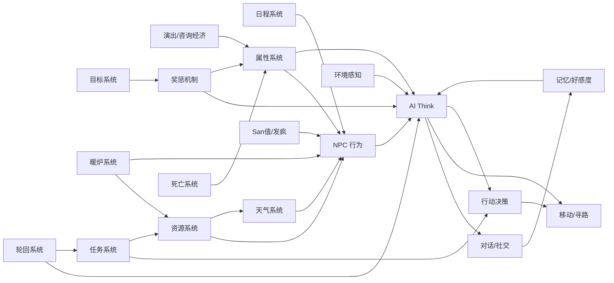

# 🏘️ 福音小镇 (Gospel Town) — 项目总览

> **灵感来源**: 星露谷物语 · 鹬鹕镇  
**技术路线**: 纯前端架构（HTML5 Canvas + Vanilla JS + LLM API）  
**LLM 支持**: GLM-4-Flash（云端）/ Qwen3-14B-Q8 via Ollama（本地，推荐）  
**核心目标**: 8 位 AI 居民的像素风村落，居民能自主生活、社交、工作，玩家可以观察/对话
**当前版本**: v2.0
---

## 📋 文档索引

| 文档 | 内容 | 说明 |
|------|------|------|
| [01-design.md](01-design.md) | 🎯 设计理念 | 项目定位、与 farm3/town 的关系 |
| [02-map.md](02-map.md) | 🗺️ 地图设计 | 村庄布局、场景划分、地标、配色 |
| [03-npc.md](03-npc.md) | 👥 NPC 居民设计 | 8 个角色设定、行为循环、好感度、天气日程、发疯机制、演出经济 |
| [04-attributes.md](04-attributes.md) | 📊 属性系统 | 七大属性（体力/San值/存款/魅力/智慧/健康/情商）+ 发疯连锁影响 |
| [05-ai.md](05-ai.md) | 🤖 AI 系统 | Prompt 设计、对话系统、LLM 集成、环境感知系统 |
| [06-tech.md](06-tech.md) | ⚙️ 技术架构 | 文件结构、核心类、渲染层次、素材清单 |
| [07-plan.md](07-plan.md) | 📅 开发计划 | 分期计划、与 town 差异对比 |
| [08-changelog.md](08-changelog.md) | 📝 更新日志 | 版本历史、Bug 修复记录、功能 Checklist |
| [09-pitfalls.md](09-pitfalls.md) | 🚧 踩坑记录 | 开发经验教训、注意事项、通用原则 |

---

## 🚀 快速开始

```bash
# 直接双击 index.html 即可运行
open index.html
```

## 🎮 当前核心系统



### 8 位居民

| 角色 | 职业 | 特色 | 家庭关系 |
|------|------|------|----------|
| 李婶 | 物资总管/炊事长 | 热心精明，照顾所有人 | 陆辰的妈妈 |
| 赵铁柱 | 伐木工/锅炉工 | 沉默寡言行动力强，暗恋李婶 | — |
| 王策 | 技师/规划师 | 发电机维修×2，暖炉扩建×1.5 | — |
| 老钱 | 精神支柱/领导者 | 调解冲突×2，经验判断预警 | 清璇的爷爷 |
| 苏岩 | 医疗专家 | 治疗冻伤×2，心理疏导San恢复 | — |
| 陆辰 | 采集/建造 | 建材×1.5，耐寒体温下降×0.7 | 李婶的儿子 |
| 凌玥 | 侦察/急救/士气 | 废墟侦察稀有物资×2，士气恢复 | — |
| 清璇 | 药剂/陷阱/无线电 | 草药制剂×1.5，无线电修理 | 老钱的孙女 |